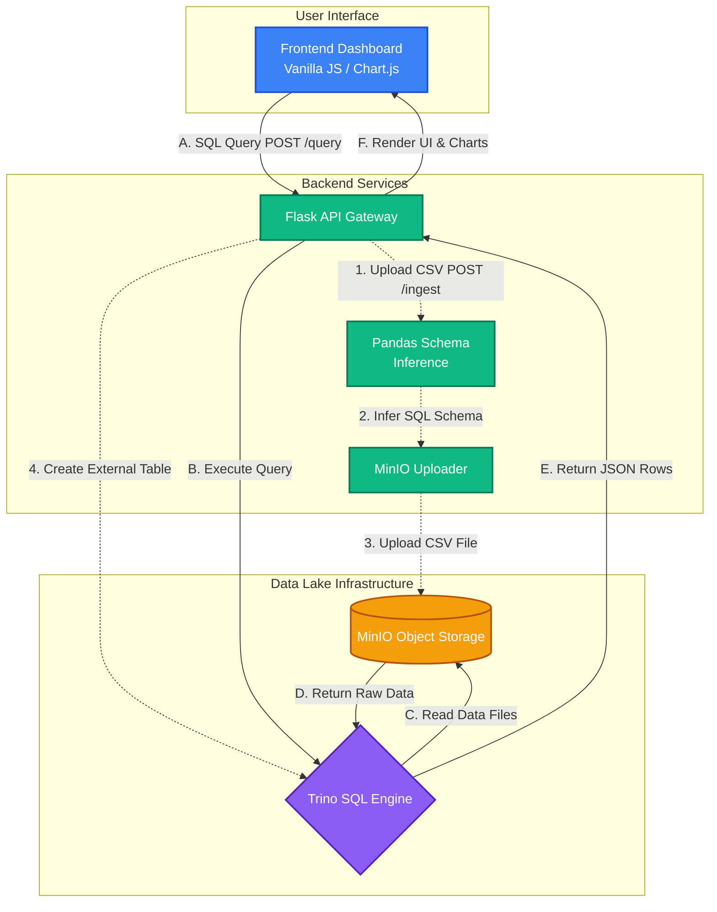
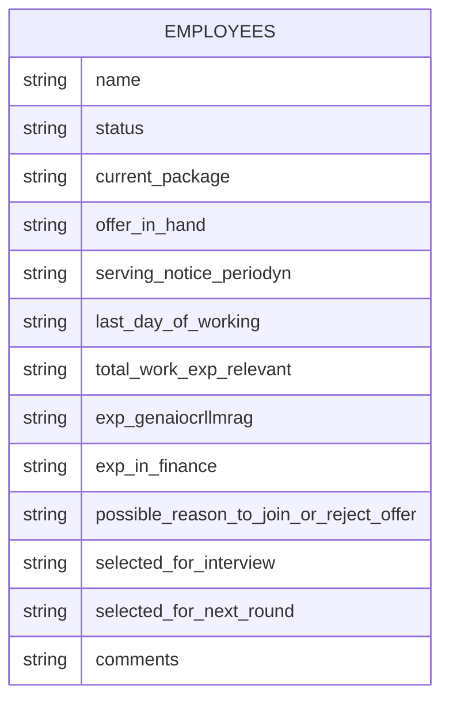

# TCAI Datalake & Analytics Platform

A professional, full-stack data lake and analytics platform built with Trino, MinIO, Flask, and Vanilla JavaScript.

This repository demonstrates a modern analytics architecture that enables distributed SQL queries against raw data stored in object storage, along with an automated data ingestion pipeline.

---

## 🏗️ Architecture & Tech Stack

### Tech Stack
| Layer | Technology |
|---|---|
| **Frontend** | HTML5, CSS3, Vanilla JavaScript, Chart.js, Vite |
| **Backend API** | Python 3, Flask, Flask-CORS, Pandas (schema inference) |
| **Data Engine** | Trino v426 (Distributed SQL) |
| **Object Storage** | MinIO (S3-compatible) |
| **Metadata** | Hive Metastore (file-based) |
| **Infrastructure** | Docker, Docker Compose |

### System Architecture
The platform is designed with two primary workflows: **Data Ingestion** and **Data Querying**.



---

## 🗄️ Entity Relationship (ER) Diagram

The datalake currently houses Analytics-related datasets. Below is the inferred schema structure for the `employees` data.



---

## 🚀 Setup Guide

Follow these instructions to set up the TCAI Datalake on your local machine.

### Prerequisites
- **Docker & Docker Compose** installed
- **Python 3.10+** installed
- **Node.js (v18+) & npm** installed

### Step 1: Start the Infrastructure (MinIO & Trino)

1. Clone this repository to your local machine.
2. Open a terminal in the root `trino-project` directory.
3. Start the containers in detached mode:
   ```bash
   docker compose up -d
   ```

> **Note:** The catalog properties file `datalake.properties` in the repo root is automatically mounted into the Trino container as the `datalake` catalog. MinIO starts at `http://localhost:9001` (Creds: `minioadmin` / `minioadmin`). Trino is available at `http://localhost:8080`.

### Step 2: Configure and Run the Backend

1. Open a new terminal and navigate to the `backend` folder:
   ```bash
   cd backend
   ```
2. Create and activate a Python virtual environment:
   ```bash
   # On Windows
   python -m venv venv
   venv\Scripts\activate

   # On Mac/Linux
   python3 -m venv venv
   source venv/bin/activate
   ```
3. Install the required Python dependencies:
   ```bash
   pip install -r requirements.txt
   ```
4. Create a `.env` file in the `backend` directory with your API key:
   ```bash
   echo TRINO_API_KEY=your_secret_key > .env
   ```
   > ⚠️ **Important:** The `.env` file is git-ignored. Never commit it. The frontend's `X-API-KEY` header value in `main.js` must match what you set here.

5. Start the Flask server:
   ```bash
   python app.py
   ```
   *The API will run locally at `http://127.0.0.1:5000`.*

### Step 3: Launch the Frontend UI

1. Open another terminal and navigate to the `frontend` directory:
   ```bash
   cd frontend
   ```
2. Install Node.js dependencies:
   ```bash
   npm install
   ```
3. Start the Vite development server:
   ```bash
   npm run dev
   ```
   *The UI will be accessible at `http://localhost:5173`.*

---

## 🗂️ Project File Structure

```
trino-project/
├── datalake.properties       # Trino catalog config (Hive + MinIO S3 settings)
├── docker-compose.yml        # MinIO + Trino container definitions
├── .gitignore
├── README.md
│
├── backend/
│   ├── app.py                # Flask API — /query and /ingest routes
│   ├── schema_inference.py   # Pandas-based CSV→SQL schema mapper
│   ├── minio_uploader.py     # MinIO file upload helper
│   ├── requirements.txt      # Python dependencies
│   └── .env                  # ⚠️ Git-ignored — create manually (see setup)
│
├── frontend/
│   ├── index.html            # Main HTML shell
│   ├── package.json          # Vite project config
│   └── src/
│       ├── main.js           # Query engine, chart rendering, upload logic
│       └── style.css         # Full UI design system
│
├── minio_data/               # ⚠️ Git-ignored — MinIO persistent storage (Docker volume)
└── trino_metadata/           # ⚠️ Git-ignored — Hive file metastore
```

---

## 🛡️ Security Features

| Feature | Details |
|---|---|
| **API Key Auth** | `/ingest` requires `X-API-KEY` header matching `.env` value |
| **Query Whitelisting** | Only `SELECT`, `SHOW`, `DESCRIBE`, `WITH` queries are permitted |
| **CORS Protection** | Restricted to `localhost:5173` and `127.0.0.1:5173` |
| **IP Whitelisting** | `/query` route only accepts connections from localhost (`127.0.0.1`, `::1`) |

---

## 💡 Usage Examples

Once the setup is complete, open your browser to `http://localhost:5173`.

### View all available tables
```sql
SHOW TABLES
```

### Query sample Analytic data (use full catalog.schema.table path)
```sql
SELECT * FROM datalake.analytic.employees LIMIT 10;
```

### Aggregate query — candidate status breakdown
```sql
SELECT
    status,
    COUNT(*) AS total_candidates
FROM
    datalake.analytic.employees
GROUP BY
    status
ORDER BY
    total_candidates DESC;
```

> **Tip:** After uploading a CSV via the Ingest panel, the SQL box is automatically populated with the correct `datalake.analytic.<table_name>` query.

---

## 🐛 Known Bugs Fixed (Changelog)

| # | File | Bug | Fix Applied |
|---|---|---|---|
| 1 | `docker-compose.yml` | Trino volume mounted non-existent `interviewdetails123.properties` → Trino failed to start | Corrected to mount `./datalake.properties` as `datalake` catalog |
| 2 | `frontend/src/main.js:54` | Auto-fill SQL used wrong catalog after CSV upload | Fixed to `datalake.analytic.*` |
| 3 | `frontend/src/main.js:110` | Error JSON parsed after early `throw`, so real server error was lost | Parse JSON first, then pass `result.error` to the thrown `Error` |
| 4 | `backend/app.py:29` | IPv6 localhost `::1` missing from `ALLOWED_IPS` set | Added `::1` to the set |
| 5 | `backend/app.py:83` | Secret API key printed in plain text to logs on every `/ingest` request | Replaced with a safe `[VALID]/[INVALID]` log message |
| 6 | `README.md:157` | Usage example SQL used bare table name `employees` (invalid in Trino) | Updated to full path `datalake.analytic.employees` |

---

## 🔧 Troubleshooting

**Trino returns 0 rows after ingestion:**
- Check the MinIO bucket `datalake` — the file should be at `<table_name>/data.csv`.
- Run `SHOW TABLES` to confirm the table was created.
- Trino uses the file metastore stored in `./trino_metadata` — ensure this directory is writable.

**Flask server fails to start:**
- Ensure `backend/.env` exists and contains `TRINO_API_KEY=<your_key>`.
- Verify Docker containers are running: `docker ps`.

**CORS or fetch errors in browser:**
- The frontend (port `5173`) and backend (port `5000`) must both be running.
- Ensure you are opening the app via `http://localhost:5173`, not via a file path.

---

*© 2026 The Celeritas AI. Enterprise Data Lake & Analytics Platform — v2.1*
